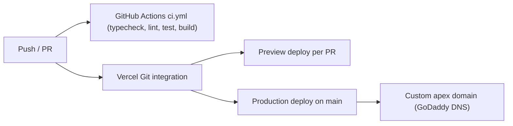

# Production Deployment

Hand-off doc for shipping Magic Fifths to production on Vercel with a custom GoDaddy
domain, plus a per-PR GitHub Actions sanity check. Self-contained: another agent or human
can execute or audit from this file alone.

Read [../../AGENTS.md](../../AGENTS.md) first for the load-bearing invariants. Nothing here
changes the app's behavior or geometry; it is packaging, CI, and hosting.

## What this app is, for deployment purposes

Magic Fifths is a static Vite + React 19 PWA. `pnpm build` (= `tsc -b && vite build`) emits a
fully self-contained static site into `dist/` with content-hashed assets and a generated
service worker. There is no backend, no API, and no runtime network request. It deploys as
pure static hosting. `base: '/'` in [../../vite.config.ts](../../vite.config.ts) is correct for
serving at a domain root.



## Status of the work in this repo

Already implemented by this plan (present in the working tree):

- [../../.github/workflows/ci.yml](../../.github/workflows/ci.yml) — per-PR CI (section 1).
- [../../vercel.json](../../vercel.json) — explicit Vercel build config + service-worker cache
  header (section 2).
- `packageManager: "pnpm@10.29.3"` in [../../package.json](../../package.json) — deterministic
  pnpm for CI and Vercel.
- In-app install button (section 4): `src/hooks/use-install-prompt.ts`,
  `src/components/InstallButton.tsx`, wired into `src/components/layout/Toolbar.tsx`, with
  `pwa.install` i18n keys in `en` + `es`.

Still requires a human (dashboard / DNS actions): Vercel project creation (section 3) and
GoDaddy DNS records (section 3). Optional polish is in section 5.

## 1. Per-PR GitHub Actions sanity check

File: [../../.github/workflows/ci.yml](../../.github/workflows/ci.yml).

Lightweight scope by design — no Playwright/Chromium, so the job is fast and hermetic. It
runs on every pull request and on push to `main`:

```yaml
name: CI
on:
  pull_request:
  push:
    branches: [main]
jobs:
  verify:
    runs-on: ubuntu-latest
    steps:
      - uses: actions/checkout@v4
      - uses: pnpm/action-setup@v4
        with:
          version: 10
      - uses: actions/setup-node@v4
        with:
          node-version: 22
          cache: pnpm
      - run: pnpm install --frozen-lockfile
      - run: pnpm typecheck
      - run: pnpm lint
      - run: pnpm test
      - run: pnpm build
```

Notes:

- `pnpm/action-setup@v4` with `version: 10` matches `packageManager: pnpm@10.29.3`.
- `--frozen-lockfile` relies on the committed `pnpm-lock.yaml` (lockfile version 9.0).
- `src/components/ui/**` is committed, so `shadcn add` is not needed in CI.
- E2E (`pnpm e2e`) is intentionally excluded here (it needs Chromium and preview servers). To
  add it later as a separate, slower job: `pnpm exec playwright install chromium` then
  `pnpm e2e`. Keep it a distinct job so the fast sanity check stays green quickly.

## 2. Vercel-ready repo config

File: [../../vercel.json](../../vercel.json).

Vercel auto-detects Vite, reads `pnpm-lock.yaml` to use pnpm, runs `pnpm build`, and serves
`dist/`. The `vercel.json` makes this explicit and, importantly, sets the correct cache
header for the generated service worker so PWA updates are not blocked by a stale `sw.js`:

```json
{
  "$schema": "https://openapi.vercel.sh/vercel.json",
  "framework": "vite",
  "buildCommand": "pnpm build",
  "outputDirectory": "dist",
  "headers": [
    {
      "source": "/sw.js",
      "headers": [
        { "key": "Cache-Control", "value": "public, max-age=0, must-revalidate" }
      ]
    }
  ]
}
```

Notes:

- Routing is query-param based (`/?key=...`, `&mode=...`), so no SPA catch-all rewrite is
  required. The PWA also sets `navigateFallback: 'index.html'` for offline navigation.
- `dist/` is gitignored and must stay that way; Vercel builds fresh from source. Any `dist/`
  files in a local tree are build artifacts and should not be committed.
- No environment variables are required for a default deploy. `VITE_MIN_LANDSCAPE_WIDTH`
  (orientation gate width) and `VITE_E2E` are optional and can be set in Vercel later.

### Vercel setup steps (human)

1. Sign in to Vercel and "Add New… → Project" → import the GitHub repo (grant repo access).
2. Confirm detected settings: Framework = Vite, Build Command = `pnpm build`, Output
   Directory = `dist`, Install Command = `pnpm install`.
3. Project Settings → General → Node.js Version → set to **22.x**. (The `engines.node` range
   `^20.19.0 || >=22.12.0` is satisfied by 22.x; pinning in the dashboard avoids ambiguity.)
4. Deploy. Every PR now gets a Preview URL; pushes to `main` publish Production. Before
   switching DNS, verify the app works at the `*.vercel.app` URL.

## 3. Custom domain (GoDaddy, apex as primary)

Decision: the apex/root (e.g. `example.com`) is the primary URL; `www` redirects to it.

In Vercel → Project → Settings → Domains:

1. Add `example.com` and `www.example.com`.
2. Set `www.example.com` to redirect to `example.com` (Vercel offers this when both exist).
3. Vercel shows the exact records to create. Typically:
   - Apex `A` record: `@` → `76.76.21.21`
   - `www` `CNAME`: `www` → `cname.vercel-dns.com`
   Always use the values Vercel displays for this project; the IP above is Vercel's standard
   anycast address but confirm it in the dashboard.

In GoDaddy → your domain → DNS → Manage DNS:

1. Replace GoDaddy's default parking `A` record on `@` with the `A` record Vercel shows
   (`76.76.21.21`). Remove any leftover parking/forwarding record on the apex.
2. Add a `CNAME` record: host `www` → `cname.vercel-dns.com`.
3. Leave TTL at default. Propagation is usually minutes but can take up to 48h.
4. Return to Vercel and wait for both domains to show "Valid Configuration". TLS certificates
   are issued automatically once DNS resolves.

Alternative: point GoDaddy's nameservers at Vercel (full DNS delegation). Prefer the
record-level approach above when other GoDaddy DNS records (email/MX, verification TXT, etc.)
must be preserved, since delegation moves all DNS management to Vercel.

## 4. In-app install button (implemented)

Adds a toolbar icon so users can install the PWA without hunting for the browser's built-in
prompt. Mirrors the existing PWA/share patterns.

Platform behavior:

- Chrome / Edge / Android: the hook captures the `beforeinstallprompt` event,
  `preventDefault()`s it, and calls `.prompt()` on click — a real one-tap install.
- iOS Safari: never fires `beforeinstallprompt`, so `canInstall` stays false and the button
  is hidden. (Install on iOS is manual: Share → Add to Home Screen.)
- Already installed / running standalone: hidden, via the `appinstalled` event and
  `matchMedia('(display-mode: standalone)')` (plus iOS `navigator.standalone`).

Files:

- `src/hooks/use-install-prompt.ts` — mirrors `src/hooks/use-pwa-update.ts`. Adds/removes the
  event listeners inside an effect; `setState` happens in listener callbacks (allowed), never
  synchronously in the effect body (`react-hooks/set-state-in-effect`). Exposes
  `{ canInstall, promptInstall }`.
- `src/components/InstallButton.tsx` — mirrors `src/components/ShareButton.tsx`
  (`variant: 'icon' | 'menu'`, `lucide-react` `Download`, `data-testid="install-button-toolbar"`,
  `aria-label={t('pwa.install.label')}`). Returns `null` when `!canInstall`.
- `src/components/layout/Toolbar.tsx` — renders `<InstallButton variant="icon" />` next to
  `<ShareButton />`.
- i18n: `pwa.install.{label,menu}` added to `src/i18n/locales/en/common.json` and
  `src/i18n/locales/es/common.json` (the locale-parity test enforces key symmetry).

Testing note: because `beforeinstallprompt` cannot be triggered from Playwright reliably, the
button has no E2E coverage; it renders `null` by default so it does not affect existing specs.
If coverage is wanted, dispatch a synthetic `beforeinstallprompt` event via `page.evaluate`.

## 5. Optional PWA polish backlog (non-blocking)

The app is already installable and works offline. None of these affect installability; track
as follow-ups.

- Manifest `id: '/'` in [../../vite.config.ts](../../vite.config.ts) `VitePWA.manifest` — stable
  PWA identity across future `start_url` changes.
- Manifest `lang` / `dir` — minor; app ships en + es via i18n.
- Manifest `screenshots` (with `form_factor: 'wide'` and a narrow entry) — unlocks the richer
  "app-like" install dialog on Android/desktop. Requires 1–2 screenshot PNGs in `public/`.
- iOS `apple-touch-startup-image` splash screens in [../../index.html](../../index.html) — cosmetic
  launch splash on iOS; install already works without them.

## Verification checklist

- CI: open a PR (or push a branch) and confirm the `verify` job is green.
- Local parity of this work: `pnpm typecheck && pnpm lint && pnpm test && pnpm build`.
- Vercel: a PR produces a Preview deploy that builds; `main` publishes Production at the
  `*.vercel.app` URL.
- Domain: after DNS propagates, load `https://example.com`, confirm valid TLS, confirm
  `www` → apex redirect, and verify PWA install + offline reload on the live domain.
