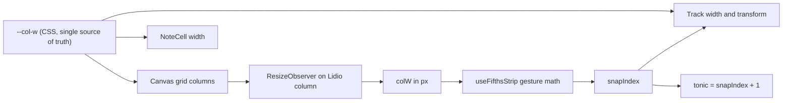

# Magic Fifths - PWA Rewrite Plan

- **Date:** 2026-09-11
- **Branch:** `pwa-refactor`
- **Status:** Awaiting approval (nothing implemented yet)
- **Starting point:** empty working tree (the old Ionic 1 / AngularJS / Bower app is deleted and will not be referenced)

This document is the recoverable source of truth for the session. If context is lost,
read this file, then `AGENTS.md`, then `docs/architecture.md`.

---

## 1. Product summary

A UI-only, fully offline-capable PWA that reproduces a physical cardboard music tool.

A brown **board** ("the canvas") holds a static table of the seven Greek modes and the
triad / tetrad quality of each. A white **paper strip** slides horizontally behind a
channel in the board. The strip is one continuous chain of perfect fifths. Whichever
seven consecutive notes sit inside the channel are the seven modes of one major scale.

Verified against the reference photo:

| Column | 1 | 2 | 3 | 4 | 5 | 6 | 7 |
|---|---|---|---|---|---|---|---|
| Mode (es) | Lidio | Jónico | Mixolidio | Dórico | Eólico | Frigio | Locrio |
| Triad | M | M | M | m | m | m | dim |
| Tetrad | Maj7 | Maj7 | 7 | m7 | m7 | m7 | m7(b5) |

At the natural rest position the channel shows `fa do sol re la mi si` / `F C G D A E B`.
Those are exactly the modes of **C major**, and `C` sits under **Jónico**. Therefore:

> **Invariant:** the note aligned to the *Jónico* column is the tonic of the current major scale.

---

## 2. Decisions locked in with the user

- Locales: **English + Spanish** (structure supports adding more by dropping in a folder).
- Strip labels: **three rows exactly like the cardboard** - solfège on top, accidental
  symbol in the middle, letter name at the bottom.
- The strip **bleeds past the canvas edges**, like the paper sticking out of the cardboard
  in the photo.
- Hosting: **root domain** (Netlify / Vercel / Cloudflare), so Vite `base: '/'`. No deploy
  workflow in this change.

---

## 3. Stack (versions resolved against npm on 2026-09-11)

| Package | Version | Why |
|---|---|---|
| `vite` | 8.3.0 | Rolldown-based; needs Node `^20.19 \|\| >=22.12`. Local Node is 20.20.0. OK. |
| `@vitejs/plugin-react` | 6.1.1 | Peer-matched to Vite 8. |
| `react` / `react-dom` | 19.3.0 | Current stable. |
| `typescript` | **6.0.3** | Deliberately *not* 7.0.2 - see ADR-001. |
| `tailwindcss` + `@tailwindcss/vite` | 4.3.3 | CSS-first config, no `tailwind.config.js`. |
| `shadcn` (CLI) | 4.21.0 | Generates components into `src/components/ui`. |
| `tw-animate-css` | 1.4.0 | Replaces the removed `tailwindcss-animate`. |
| `vite-plugin-pwa` | 1.3.0 | Supports Vite 8. |
| `workbox-window` / `workbox-build` | 7.4.1 | Peer of the above. |
| `i18next` / `react-i18next` | 26.4.2 / 17.0.13 | JSON catalogs, runtime language switch. |
| `i18next-resources-to-backend` | latest | Lazy `import()` of locale JSON -> auto-precached. |
| `@playwright/test` | 1.63.0 | E2E. System `google-chrome` already present. |
| `vitest` | 5.0.0 | Unit tests for the music + snap math only. |
| `eslint` / `typescript-eslint` | 10.10.0 / 8.70.0 | Lint. |
| `@fontsource-variable/caveat` | latest | Self-hosted handwriting font (offline-safe). |

### ADR-001: pin TypeScript to 6.0.3, not 7.0.2

`typescript-eslint@8.70.0` declares `typescript: ">=4.8.4 <6.1.0"`. TypeScript 7 (the native
Go compiler) is stable on npm but would break linting, and there is no
`typescript-eslint` release that supports it yet. TS 6.0.3 is the newest version inside the
supported range. Revisit when `typescript-eslint` v9 ships.

---

## 4. Repository layout

```
magic-fifths/
├── AGENTS.md                         # canonical agent entry point
├── README.md
├── components.json                   # shadcn config
├── vite.config.ts
├── playwright.config.ts
├── vitest.config.ts
├── eslint.config.js
├── tsconfig.json / tsconfig.app.json / tsconfig.node.json
├── docs/
│   ├── plans/2026-09-11-pwa-refactor.md   # this file
│   ├── architecture.md
│   ├── music-theory.md
│   ├── decisions.md                  # ADR log
│   └── agent-log.md                  # append-only journal for the next AI
├── public/
│   ├── favicon.svg
│   └── icons/{pwa-192,pwa-512,maskable-512,apple-touch-icon}.png
├── e2e/
│   ├── helpers/strip.ts              # drag + settle helpers
│   ├── smoke.spec.ts
│   ├── strip-snap.spec.ts
│   ├── alignment.spec.ts
│   ├── i18n.spec.ts
│   ├── theme.spec.ts
│   ├── orientation.spec.ts
│   ├── sidebar.spec.ts
│   └── pwa-offline.spec.ts
└── src/
    ├── main.tsx
    ├── App.tsx
    ├── index.css                     # @import "tailwindcss" + @theme tokens
    ├── styles/cardboard.css          # custom CSS for board / paper / channel
    ├── lib/
    │   ├── config.ts                 # MIN_LANDSCAPE_WIDTH, CANVAS_MAX_W, gesture tuning
    │   ├── utils.ts                  # cn()
    │   ├── storage.ts                # typed, try/catch localStorage under "mf:v1:"
    │   ├── share.ts                  # encodeKeyToken / parseKeyToken / buildShareUrl
    │   └── music/
    │       ├── notes.ts              # buildFifthsChain()
    │       ├── modes.ts              # MODES + triads + tetrads
    │       ├── scales.ts             # scale registry (major only for now)
    │       └── snap.ts               # pure snap math
    ├── i18n/
    │   ├── index.ts
    │   └── locales/{en,es}/{common,music,howto,theory}.json
    ├── context/
    │   └── SettingsContext.tsx       # theme, language, scaleId + useSettings()
    ├── hooks/
    │   ├── usePersistedState.ts      # useState + localStorage write-through
    │   ├── useFifthsStrip.ts         # THE gesture + snap engine (owns snapIndex)
    │   ├── useColumnWidth.ts         # ResizeObserver -> px column width
    │   ├── useViewportGate.ts        # orientation / min-width gate
    │   ├── useSidebarMode.ts         # persistent rail vs sheet
    │   ├── useShareLink.ts           # Web Share API + clipboard fallback
    │   └── usePWAUpdate.ts
    └── components/
        ├── ui/                       # shadcn-generated primitives
        ├── canvas/
        │   ├── Canvas.tsx            # grid owner, declares --col-w
        │   ├── ModesHeader.tsx       # vertical mode names
        │   ├── QualityRows.tsx       # Tríadas + Tétradas
        │   ├── FifthsStrip.tsx       # channel + track
        │   ├── NoteCell.tsx          # 3-row cell
        │   └── KeyReadout.tsx        # "C major" caption
        ├── layout/{AppShell,AppSidebar,SidebarContent,Toolbar}.tsx
        ├── ShareButton.tsx           # native share sheet -> clipboard fallback
        ├── dialogs/{HowToUseDialog,FifthsTheoryDialog}.tsx
        ├── OrientationGate.tsx
        ├── DebugOverlay.tsx          # dev-only, ?debug=1
        └── pwa/UpdatePrompt.tsx
```

---

## 5. Music domain (`src/lib/music`)

### The chain

Five blocks of the base cycle `F C G D A E B`, 35 notes total, continuous in fifths:

```
idx  0..6   Fbb Cbb Gbb Dbb Abb Ebb Bbb
idx  7..13  Fb  Cb  Gb  Db  Ab  Eb  Bb
idx 14..20  F   C   G   D   A   E   B      <- natural block, default rest
idx 21..27  F#  C#  G#  D#  A#  E#  B#
idx 28..34  F## C## G## D## A## E## B##
```

Continuity holds across block seams (`Bb -> F`, `B -> F#`), so it is one straight line
through the circle of fifths, not five separate strips.

```ts
export type Accidental = 'bb' | 'b' | '' | '#' | 'x';

export interface ChainNote {
  index: number;        // 0..34
  letter: 'F'|'C'|'G'|'D'|'A'|'E'|'B';
  solfegeKey: string;   // i18n key: 'music:solfege.fa'
  accidental: Accidental;
  letterLabel: string;  // 'Bb', 'F##'
}
```

Accidental glyphs are rendered as `♭♭ / ♭ / (blank) / ♯ / 𝄪`, matching the photo (the
double-sharp is drawn as an `x`).

### Modes

```ts
export const MODES = [
  { id: 'lydian',     degree: 4, triad: 'M',   tetrad: 'maj7' },
  { id: 'ionian',     degree: 1, triad: 'M',   tetrad: 'maj7' },
  { id: 'mixolydian', degree: 5, triad: 'M',   tetrad: 'dom7' },
  { id: 'dorian',     degree: 2, triad: 'm',   tetrad: 'min7' },
  { id: 'aeolian',    degree: 6, triad: 'm',   tetrad: 'min7' },
  { id: 'phrygian',   degree: 3, triad: 'm',   tetrad: 'min7' },
  { id: 'locrian',    degree: 7, triad: 'dim', tetrad: 'min7b5' },
] as const;

export const TONIC_COLUMN = 1; // Jónico
```

### Snap math (pure, unit-tested)

```ts
export const COLUMNS = 7;
export const MAX_SNAP = 35 - COLUMNS;   // 28  -> 29 valid positions
export const DEFAULT_SNAP = 14;         // natural block -> C major

export const clampSnap  = (i: number) => Math.min(MAX_SNAP, Math.max(0, Math.round(i)));
export const offsetFor  = (i: number, colW: number) => -i * colW;
export const snapFor     = (offset: number, colW: number) => clampSnap(-offset / colW);
export const tonicIndex = (snapIndex: number) => snapIndex + TONIC_COLUMN;
export const snapForTonic = (chainIndex: number) => clampSnap(chainIndex - TONIC_COLUMN);
```

`tonicIndex` / `snapForTonic` are a bijection over the 29 valid positions, which is what
lets a share link address a position by its musical key rather than by a raw index.

---

## 6. Geometry - the one thing that must be exact

The requirement "it should snap correctly with the modes columns" is guaranteed **by
construction**, not by tuning, using a single CSS custom property.

`Canvas.tsx` owns the grid and declares the column width:

```css
.mf-canvas {
  --canvas-max-w: 1100px;                 /* configurable */
  --label-w: clamp(4.5rem, 9vw, 7rem);
  --col-w: calc((min(100%, var(--canvas-max-w)) - var(--label-w)) / 7);
  display: grid;
  grid-template-columns: var(--label-w) repeat(7, var(--col-w));
  grid-template-rows: auto auto auto auto; /* Modos | channel | Tríadas | Tétradas */
}
```

`FifthsStrip` is absolutely positioned so that **its left edge is the Lidio column's left
edge**, is exactly `7 * --col-w` wide, and has `overflow: visible` so the paper bleeds out:

```css
.mf-strip-window { width: calc(7 * var(--col-w)); overflow: visible; touch-action: none; }
.mf-strip-track {
  width: calc(35 * var(--col-w));
  transform: translate3d(var(--strip-x), 0, 0);
  will-change: transform;
}
.mf-note-cell { width: var(--col-w); }
```

At rest, `--strip-x = calc(-1 * <snapIndex> * var(--col-w))`, so chain cell `k` sits at
`lidioLeft + (k - snapIndex) * colW`. Cell `snapIndex + n` therefore lands exactly on mode
column `n`. Zero drift, no magic numbers, and it survives any resize because both sides
read the same `--col-w`.

Bleed is clipped only at the app root (`overflow-x: clip`), never at the canvas.

JS needs `colW` in pixels for gesture math. `useColumnWidth` gets it from a
`ResizeObserver` on the real Lidio column element (`contentRect.width`) - authoritative,
no string parsing of computed styles.



---

## 7. State, the gesture engine, and share links

### ADR-006: plain React Context, no state library

There is almost no state here. Three user settings (`theme`, `language`, `scaleId`) plus one
canvas-local `snapIndex`. Nothing is async, nothing fans out across distant subtrees, and
nothing needs derived selectors or middleware.

- **Settings** live in a single `SettingsContext` at the app root. The provider memoizes its
  value and only three low-frequency setters can change it, so re-render cost is a
  non-issue. `useSettings()` is the only consumer API.
- **`language`** stays owned by i18next, which is already a runtime store. `setLanguage`
  calls `i18n.changeLanguage(lng)` and persists the choice; the context reads back from
  `i18n.language` on the `languageChanged` event. One source of truth, no mirror to drift.
- **`snapIndex`** never leaves the canvas subtree. `useFifthsStrip` owns it and passes it to
  `FifthsStrip`, `NoteCell` and `KeyReadout` as props. The sidebar has no interest in it, so
  lifting it to global state would be pure ceremony.
- **Persistence** is a 20-line `lib/storage.ts` (typed get/set, `try/catch` for Safari
  private mode, `mf:v1:` key prefix) behind `usePersistedState`. That is all
  `zustand/middleware/persist` would have given us.

The decisive argument: **the only high-frequency state is the drag offset, and it must
bypass React entirely regardless.** During a gesture, `useFifthsStrip` writes
`track.style.setProperty('--strip-x', ...)` directly on the DOM node every frame and calls
`setState` only once, on settle. Re-rendering 35 cells per frame would be the actual
performance problem, and no store solves that. Since the hot path never touches React
state, a store's selector and equality machinery buys nothing here, and skipping it keeps
one more dependency out of an offline-first bundle.

Revisit only if a future scale/mode feature needs cross-tree state; the `useSettings()`
boundary means swapping the implementation later touches one file.

### ADR-002: custom Pointer Events engine, not CSS scroll-snap and not Embla

- **CSS `scroll-snap`** gives great native touch momentum, but aligning snap points to a
  grid that lives in a *different* element needs `scroll-padding` plus leading/trailing
  spacers, mouse drag is not native, and programmatic re-snap after setting `scrollLeft`
  is inconsistent across engines. Too many edge cases for the app's single critical feature.
- **Embla / shadcn `Carousel`** solves drag physics but owns its own layout and clipping;
  reverse-engineering its alignment to our 7-column grid is harder to verify than the math
  above, and visible-overflow "peek" mode fights `containScroll`.
- **Custom engine** keeps `index = round(-x / colW)` exact, behaves identically for mouse,
  touch, pen, wheel and keyboard, and is trivially deterministic for Playwright.

The user explicitly allowed custom CSS for this part; this is where that budget goes.

### Behaviour

- `pointerdown` - `setPointerCapture`, cancel any running animation, record `startX` and
  `startOffset`, begin velocity sampling.
- `pointermove` - `offset = startOffset + (x - startX)`. Past either end, apply rubber-band
  resistance (`limit + delta * 0.4`) so the paper feels physical. The new offset is written
  straight to the track node as `--strip-x`; **no React state is touched during the drag.**
- `pointerup` / `pointercancel` - velocity is an exponentially weighted average of the last
  ~80 ms of samples (raw last-delta velocity is jittery and makes flicks feel random);
  `projected = offset + velocity * 180`; `target = clampSnap(-projected / colW)`. A flick
  above `MIN_FLICK_VELOCITY` always advances at least one column even if the finger barely
  moved, which is the single biggest contributor to feeling native. Then animate with a
  critically damped spring, duration scaled by distance and clamped to 180-420 ms.
- `wheel` - accumulate horizontal delta, snap after a short idle.
- **Keyboard** - the window is `role="slider"` with `aria-valuemin/max/now` and
  `aria-valuetext` = localized key name. `ArrowLeft/Right` = +/-1, `PageUp/Down` = +/-7
  (one accidental block), `Home/End` = extremes.
- **Tap a note cell** - that note animates to the Jónico column and becomes the tonic.
- `prefers-reduced-motion: reduce` - snap instantly, no spring.

### Smoothness budget - keeping it native-feeling

The goal is 60/120 fps with no jank on a mid-range phone, so every frame stays on the
compositor:

- **Transform only.** The track animates `translate3d` and nothing else. No `left`, no
  `width`, no layout, no paint. `will-change: transform` on the track, `contain: paint` on
  the window.
- **No React in the hot path.** Both the drag and the spring run in one `requestAnimationFrame`
  loop that writes `--strip-x` on the track node. React renders once per gesture.
- **`React.memo` on `NoteCell`.** The 35 cells' content is static; only `data-in-window` and
  `data-mode` change, and only on settle, so even the one render per gesture is cheap.
- **Gesture hygiene** that separates "native-feeling" from "web-feeling":
  `touch-action: none` on the window, `user-select: none`,
  `-webkit-tap-highlight-color: transparent`, and `overscroll-behavior-x: none` on
  `html, body` to kill Chrome Android's and iOS Safari's edge-swipe back navigation - without
  that last one, a left flick near the screen edge navigates away instead of moving the strip.
- All tuning constants (`RELEASE_PROJECTION_MS`, `MIN_FLICK_VELOCITY`, `RUBBER_BAND_FACTOR`,
  spring stiffness/damping, duration clamp) live in `src/lib/config.ts` so feel can be tuned
  without touching the engine.

### The settle boundary - the one place derived state is computed

Per the user's note, everything expensive or observable happens in a single `onSettle(index)`
callback that fires once, after the spring finishes:

1. `setSnapIndex(index)` - the only React render of the gesture.
2. Derive `tonic`, the seven mode-to-note mappings, and the localized `aria-valuetext`.
3. Write the `data-snap-index`, `data-tonic`, `data-in-window`, `data-mode` attributes and
   flip `data-settled="true"`.
4. Persist to `mf:v1:snapIndex`.
5. `history.replaceState` the `?key=` param (see ADR-007 below).

This keeps the gesture itself pure motion, and gives Playwright and the agent exactly one
deterministic moment to observe.

### ADR-007: share links and URL state

Storing the settled position is what makes it shareable, so the two features are designed
together.

- **Param:** `?key=<token>`, where the token is the **tonic** (the note under Jónico), not
  the raw index. `?key=Eb` is human-readable, hand-typeable, and stays valid if the chain
  is ever extended; `?pos=17` is neither. The mapping is a bijection - the 29 snap positions
  yield 29 distinct tonics, `Cbb` through `C##`.
- **Token spelling:** URL-safe by construction, since a share link's whole job is surviving
  copy/paste through chat apps and QR codes. Flats stay `b`/`bb`, sharps become `s`/`ss`:
  `?key=C`, `?key=Bb`, `?key=Fs`, `?key=Css`. This avoids `#` entirely, which would
  otherwise be percent-encoded to `%23` (or worse, truncated as a fragment). The parser
  also accepts the displayed spellings `#` and `x` so hand-typed links work.
- **`replaceState`, never `pushState`.** Every snap would otherwise add a history entry and
  make the back button useless. The URL trails the position; it does not record it.
- **Read on mount:** a valid `?key=` wins over the persisted value, because an explicit
  deep link beats last session's state. An invalid or absent token falls back to
  persisted, then `DEFAULT_SNAP` (C major).
- **Share button** (`components/ShareButton.tsx`, `hooks/useShareLink.ts`):
  `navigator.share({ title, text, url })` when available - the native share sheet, which is
  exactly right for an installed PWA on phone or tablet - falling back to
  `navigator.clipboard.writeText(url)` plus a `sonner` toast. Both paths are offline-safe;
  neither needs the network.
- **Placement:** a sidebar menu item next to the other options, plus an icon button in the
  slim top toolbar beside the sidebar trigger, since sharing "this exact chord wheel
  position" is a mid-task action and shouldn't require opening the drawer.
- `lib/share.ts` holds `encodeKeyToken`, `parseKeyToken` and `buildShareUrl`, all pure and
  unit-tested against all 29 positions.

### Test surface (so an AI can verify without a human)

- `[data-testid="fifths-strip"]` carries `data-snap-index`, `data-tonic`, `data-settled`.
  Playwright waits on `data-settled="true"` instead of sleeping.
- `[data-testid="note-cell"]` carries `data-chain-index`, `data-note`, `data-in-window`,
  and `data-mode` when inside the channel.
- `[data-testid="mode-column"]` carries `data-mode`, `data-triad`, `data-tetrad`.
- `window.__mf__` bridge, only when `import.meta.env.DEV || import.meta.env.VITE_E2E`:
  `{ getSnapIndex(), setSnapIndex(i), getGeometry(), getAlignmentDeltas() }`. Lets the agent
  jump to any state deterministically via `browser_cdp` / `page.evaluate`.
- `?debug=1` renders `DebugOverlay` with `snapIndex`, `colW`, `offset`, tonic, and the
  per-column alignment delta in pixels - so a single screenshot proves or disproves
  alignment.

---

## 8. Responsiveness and the orientation gate

`src/lib/config.ts`:

```ts
export const MIN_LANDSCAPE_WIDTH = Number(import.meta.env.VITE_MIN_LANDSCAPE_WIDTH ?? 468);
export const CANVAS_MAX_WIDTH = 1100;
export const SIDEBAR_PERSISTENT_QUERY = '(min-width: 1024px) and (min-height: 600px)';

// Gesture feel - tune these, not the engine.
export const RELEASE_PROJECTION_MS = 180;
export const MIN_FLICK_VELOCITY = 0.35;   // px/ms; above this, always advance >= 1 column
export const RUBBER_BAND_FACTOR = 0.4;
export const SNAP_DURATION_MS = { min: 180, max: 420 };
```

- **Gate:** when `window.innerWidth < MIN_LANDSCAPE_WIDTH`, a full-screen overlay
  (`[data-testid="orientation-gate"]`) shows a rotate-device illustration and localized
  copy. Driven by width only, so it clears on rotation *and* on desktop window resize.
- **Manifest** sets `orientation: "landscape"`; on user-gesture entry to fullscreen we also
  attempt `screen.orientation.lock('landscape')` inside `try/catch` (browsers only honour
  it in fullscreen/installed mode).
- **Large screens:** canvas capped at `CANVAS_MAX_WIDTH` and centered; a height clamp plus
  `clamp()` typography keep it inside short landscape viewports without vertical scrolling.
- **Sidebar mode:** persistent rail only when `SIDEBAR_PERSISTENT_QUERY` matches. A phone in
  landscape (844x390) fails the height test and gets the drawer, which is what we want -
  horizontal space belongs to the canvas.

---

## 9. App shell, sidebar and dialogs

Built on shadcn `sidebar`, `sheet`, `dialog`, `select`, `switch`, `button`, `tooltip`,
`separator`, `scroll-area`, `sonner`.

Sidebar items:

1. **Scale** - `Select`, `Major` only; other scales listed disabled with a "coming soon" hint.
2. **Language** - `Select`, English / Español; calls `useSettings().setLanguage`, which
   drives `i18n.changeLanguage`, persists the choice and updates `<html lang>`.
3. **Theme** - light / dark / system toggle, driven by a `dark` class on `<html>` with
   `@custom-variant dark (&:where(.dark, .dark *));` in `index.css`.
4. **How to Use It** - `Dialog`, content from `howto` namespace.
5. **Fifths Theory** - `Dialog` with `ScrollArea`, content from `theory` namespace.
6. **Share** - `ShareButton`, which copies or natively shares the current `?key=` deep link.
   Mirrored as an icon button in the slim `Toolbar` next to the sidebar trigger.

`AppSidebar` collapses to the standard mobile drawer (`Sheet`) below the breakpoint, with a
`SidebarTrigger` hamburger pinned in a corner so it never overlaps the canvas.

---

## 10. Localization

- `i18next` + `react-i18next` + `i18next-resources-to-backend` with
  `import('./locales/' + lng + '/' + ns + '.json')`. Vite emits each catalog as its own
  chunk, and `globPatterns` precaches all chunks, so **every language works offline** with
  no extra PWA config.
- Namespaces: `common` (chrome, gate, PWA prompts), `music` (mode names, solfège, chord
  qualities, scale names), `howto`, `theory`.
- Compile-time key checking by augmenting `CustomTypeOptions['resources']` with
  `typeof import('./locales/en/common.json')` etc., so a missing Spanish key is a type error.
- Detection order: persisted `mf:v1:language` -> `navigator.language` -> `en`.
- No string literals in components; the E2E i18n spec asserts mode names change when
  switching to Spanish, which also guards against hardcoded text.

---

## 11. Cardboard visuals (`src/styles/cardboard.css`)

Custom CSS, since this is exactly the case Tailwind is bad at:

- **Board:** layered `linear-gradient` + an inline-SVG `feTurbulence` data-URI for fibre
  noise, warm brown palette, soft outer shadow, slightly irregular hand-cut edges.
- **Channel:** the strip row is rendered as a recessed slot with `inset` shadows on its top
  and bottom lips. The lips sit above the paper in `z-index`, so the strip genuinely looks
  threaded through the board.
- **Paper:** off-white with faint fibre texture and a thin drop shadow. The bleeding
  portions outside the board get a small darkening plus the board's edge shadow cast onto
  them, reproducing the photo.
- **Ink:** hairline rules with a slightly uneven brown-black, `Caveat` handwriting font for
  the labels. Mode names use `writing-mode: vertical-rl` (vertical, like the photo), which
  also saves precious horizontal space in landscape.
- Both light and dark palettes are defined as CSS variables in `@theme`; dark mode is a
  dimmed-lamp version rather than an inverted one.

---

## 12. PWA and offline

```ts
VitePWA({
  registerType: 'prompt',
  strategies: 'generateSW',
  includeAssets: ['favicon.svg', 'icons/*.png'],
  workbox: {
    globPatterns: ['**/*.{js,css,html,svg,png,woff2,json}'],
    navigateFallback: 'index.html',
    cleanupOutdatedCaches: true,
  },
  manifest: {
    name: 'Magic Fifths', short_name: 'Fifths',
    display: 'standalone', orientation: 'landscape',
    background_color: '#f5efe3', theme_color: '#8b5e34',
    categories: ['music', 'education'],
    icons: [ /* 192, 512, 512-maskable */ ],
  },
  devOptions: { enabled: true, type: 'module' },
})
```

- `base: '/'` (root hosting, per the user's choice).
- `registerType: 'prompt'` + `UpdatePrompt` toast, so a new version never reloads the page
  mid-gesture.
- **Zero external requests at runtime.** Fonts are self-hosted via `@fontsource-variable`,
  and there is no API, so precache alone gives complete offline capability. No
  `runtimeCaching` rules are needed.
- `devOptions.enabled` lets the agent inspect the service worker from the Cursor browser in
  dev, without a production build.

---

## 13. Testing

### Playwright projects

`playwright.config.ts` runs two web servers so both dev behaviour and the real service
worker are covered:

```ts
webServer: [
  { command: 'pnpm dev --port 5173',                    url: 'http://localhost:5173', reuseExistingServer: !process.env.CI },
  { command: 'pnpm build && pnpm preview --port 4173',  url: 'http://localhost:4173', reuseExistingServer: !process.env.CI },
]
```

Projects: `desktop` (1440x900), `tablet-landscape` (iPad Pro 11 landscape),
`phone-landscape` (900x414, `hasTouch`, `isMobile`), `phone-portrait` (gate spec only),
and `pwa` (baseURL `:4173`, Chromium only).

Settings used so failures are debuggable with no human in the loop:
`reporter: [['list'], ['html', { open: 'never' }]]`, `trace: 'on-first-retry'`,
`screenshot: 'only-on-failure'`, `video: 'retain-on-failure'`.

### Specs

1. `smoke` - app renders; 7 `mode-column`s with the correct mode / triad / tetrad text;
   default tonic is `C`.
2. `alignment` - **the critical one.** For snap indices 0, 7, 14, 21, 28, assert every
   in-window note cell's `getBoundingClientRect().left` matches its mode column's within
   1.5 px. Repeated at all four viewports.
3. `strip-snap` - real `mouse.down/move/up` drag of 1.4 columns lands exactly 1 column; a
   fast flick travels several columns; clamping holds at indices 0 and 28; arrow keys,
   `PageUp/Down`, `Home/End`; tapping a cell makes it the tonic; the position survives a
   reload.
4. `share` - after settling on a position, the Share button puts a URL ending in the right
   `?key=` token on the clipboard (`context.grantPermissions(['clipboard-read',
   'clipboard-write'])`). The native branch is covered by stubbing `navigator.share` via
   `page.addInitScript` and asserting the captured payload, so both paths are tested without
   a real share sheet. Opening `?key=Eb` cold lands on the matching `data-snap-index` and
   passes the alignment assertion. And `history.length` must not grow after several snaps,
   which is the regression guard for `replaceState` vs `pushState`.
5. `i18n` - switch to Español, mode names become `Lidio/Jónico/...`, `<html lang="es">`,
   persists across reload, switches back.
6. `theme` - dark toggle adds `.dark` and persists.
7. `orientation` - 400x700 shows `orientation-gate`; resizing to 900x420 hides it.
8. `sidebar` - persistent rail on desktop; trigger + drawer on phone landscape; every menu
   item reachable; both dialogs open and close.
9. `pwa-offline` - against `:4173`: manifest link present, SW reaches `activated`, then
   `context.setOffline(true)` + reload still renders the canvas. This is the real proof of
   the caching requirement.

### Vitest

Pure-function specs for `lib/music/notes.ts` (chain length 35, fifth continuity across
block seams, correct accidental per block), `lib/music/snap.ts` (clamping, rounding,
`offsetFor`/`snapFor` round-trip, `tonicIndex`/`snapForTonic` bijection) and
`lib/share.ts` (`encodeKeyToken`/`parseKeyToken` round-trip over all 29 positions, the
`#`/`x` input aliases, and rejection of garbage tokens). Cheap, and they lock the invariants
that the whole UI depends on.

### Agent-driven verification loop

- `vite.config.ts` pins `server: { port: 5173, strictPort: true, host: true }` so the URL
  is always `http://localhost:5173`.
- Dense `data-testid` + ARIA roles make `browser_snapshot` output meaningful.
- `window.__mf__` is reachable through `browser_cdp` `Runtime.evaluate`.
- `?debug=1` overlay turns alignment into something a screenshot can confirm.
- Scripts: `pnpm dev`, `pnpm e2e`, `pnpm e2e -- --project=desktop`,
  `pnpm e2e:report`, `pnpm test`, `pnpm typecheck`, `pnpm lint`, `pnpm verify`
  (typecheck + lint + test + e2e).

---

## 14. Agent context files

- **`AGENTS.md`** (root, canonical entry point) - purpose, stack with pinned versions and
  the reasons, directory map, command table, the load-bearing invariants (35-note chain;
  `tonic = snapIndex + 1`; `--col-w` is the only geometry source of truth; all derived state
  is computed in `onSettle` and never mid-drag; no hardcoded UI strings), the Cursor-browser
  and Playwright recipes, and known gotchas.
- **`docs/architecture.md`** - data flow, geometry derivation, gesture state machine,
  i18n loading and its interaction with precaching.
- **`docs/music-theory.md`** - the chain, why the seven visible notes are the modes of one
  scale, why Jónico is the tonic, the triad/tetrad table.
- **`docs/decisions.md`** - ADR log seeded with ADR-001 (TypeScript pin), ADR-002 (custom
  gesture engine), ADR-003 (`resources-to-backend` for offline locales),
  ADR-004 (`generateSW` + `prompt`), ADR-005 (sidebar breakpoint includes a height test),
  ADR-006 (plain React Context instead of a state library), ADR-007 (share links address a
  position by musical key with `replaceState`, not by raw index with `pushState`).
- **`docs/agent-log.md`** - append-only journal: date, what changed, commands run, what was
  verified, what is still open.
- **`README.md`** - what the app is (with the reference photo), prerequisites (Node >= 20.19,
  pnpm), install/run/build/preview, the full script table, how to install the PWA and verify
  offline, the `?key=` share-link format with examples, how to add a language, how to change
  `MIN_LANDSCAPE_WIDTH`, how to tune the gesture constants, project structure, and a pointer
  to `AGENTS.md`.

---

## 15. Phases

| Phase | Deliverable | Done when |
|---|---|---|
| 1 | Scaffold: Vite 8 + React 19 + TS 6, Tailwind 4, shadcn init, ESLint, `@` alias, fixed dev port | `pnpm dev` serves on :5173, `pnpm typecheck` and `pnpm lint` pass |
| 2 | Music domain + Vitest + i18n wiring + en/es catalogs + `SettingsContext` + `lib/storage.ts` | `pnpm test` green; language switch works in the browser |
| 3 | Canvas: grid, `--col-w`, ModesHeader, QualityRows, FifthsStrip, `useFifthsStrip` incl. the `onSettle` boundary, `cardboard.css`, DebugOverlay | agent drags it in the Cursor browser; `?debug=1` shows ~0 px deltas; drag stays on the compositor |
| 4 | Shell: sidebar/drawer, theme, scale select, both dialogs, OrientationGate, `lib/share.ts` + `useShareLink` + ShareButton + `?key=` deep links | all menu items work at all four viewports; a shared link reopens the exact position |
| 5 | PWA: plugin config, icons, manifest, UpdatePrompt, self-hosted fonts | build + preview installs and survives offline reload |
| 6 | Playwright config + 8 specs, `AGENTS.md`, `docs/*`, `README.md` | `pnpm verify` green end to end |

## 16. Risks

- **Vite 8 / plugin-react 6 peer set** is new; if `oxc-transform-react` peers misbehave,
  fall back to Vite 7 + plugin-react 5. Checkpoint at the end of phase 1.
- **Very short landscape viewports** (390 px tall) make four stacked rows tight. Mitigated by
  vertical mode labels, `clamp()` typography, and a height-aware canvas cap; the
  `phone-landscape` Playwright project is the guard.
- **Gesture feel** is subjective. All tuning constants live in `src/lib/config.ts` so they can
  be adjusted without touching the engine.
- **Exotic accidentals** (`Cbb`, `B##`) are musically valid but unusual. They are included
  because the physical tool has them; the theory dialog explains them.
